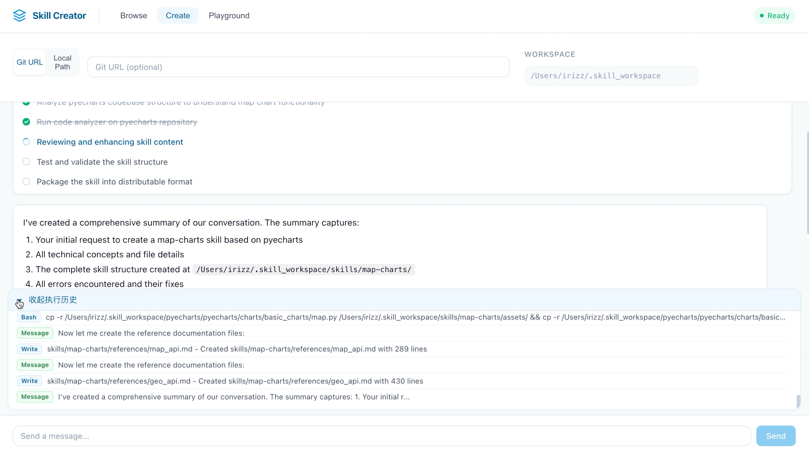
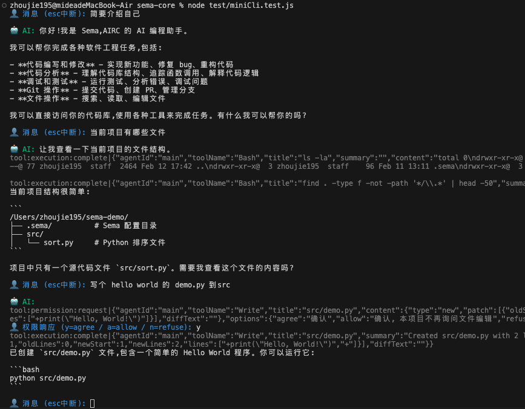

<div align="center">


An Event-Driven AI Coding Assistant Core Engine, providing reliable and pluggable intelligent processing capabilities for building code assistant tools.
</br>
<em>An Event-Driven AI Coding Assistant Core Engine</em>

[](https://github.com/midea-ai/sema-code-core/blob/main/LICENSE)
[](https://deepwiki.com/midea-ai/sema-code-core)
[](https://www.npmjs.com/package/sema-core)
[](https://midea-ai.github.io/sema-code-core)

<br/>

[简体中文](./README_CN.md) | English

</div>

## Project Overview

**Sema Code Core** is an event-driven AI coding assistant core engine that provides reliable and pluggable intelligent processing capabilities for building code assistant tools. It supports core capabilities such as multi-agent collaboration, Skill extension, and Plan mode task planning, and can be quickly integrated into various AI programming tools.

[View Documentation](https://midea-ai.github.io/sema-code-core)

## Core Features
- **Natural Language Instructions** - Directly drive programming tasks through natural language.
- **Permission Control** - Fine-grained permission management ensures safe and controllable operations.
- **Subagent Management** - Supports multi-agent collaboration and can dynamically schedule appropriate sub-agents based on task types.
- **Skill Extension Mechanism** - Provides a plugin architecture to flexibly extend AI programming capabilities.
- **Plan Mode Task Planning** - Supports decomposition and execution planning of complex tasks.
- **MCP Protocol Support** - Built-in Model Context Protocol service to support tool extension.
- **Multi-Model Support** - Compatible with Anthropic, OpenAI SDK, and supports LLM APIs from major domestic and international vendors.

## Scenarios

**IDE/Editor Plugin Development**: Provides low-level AI capability encapsulation for editors, allowing developers to focus on UI interaction without self-developing complex large model scheduling and tool calling logic.

**Enterprise Internal R&D Tools**: Private deployment + permission control, adapting to enterprise-owned models and security specifications. Out-of-the-box toolchain avoids building AI programming infrastructure from scratch.

**Vertical Domain Intelligent Workflow**: Decomposes complex engineering tasks (migration, refactoring, documentation) into automated processes. Multi-agent collaborative execution replaces manual processing of repetitive coding work.

**Academic Research and Agent Prototype Verification**: Provides a lightweight Agent experimental environment for academic institutions and independent researchers, supporting flexible combinations of toolchains and agent strategies, allowing researchers to focus on algorithmic innovation.

## Use Cases

### VSCode Extension

[Sema Code VSCode Extension](https://github.com/midea-ai/sema-code-vscode-extension) is a VSCode intelligent programming plugin based on the Sema Code Core engine.

  

### Code to Skill: Generate Skill from Codebase



## Quick Start

### Installation

```bash
npm install sema-core
```

### Minimal Example

```javascript
import { SemaCore } from 'sema-core'

// 1. Create an instance
const sema = new SemaCore({
  '/path/to/your/project', // Change to your project path
})

// 2. Add Model
// Configure model (Taking DeepSeek as an example, see "Add Model" documentation for more providers)
const modelConfig = {
  provider: 'deepseek',
  modelName: 'deepseek-chat',
  baseURL: 'https://api.deepseek.com/anthropic',
  apiKey: 'sk-your-api-key', // Replace with your API Key
  maxTokens: 8192,
  contextLength: 128000
};
const modelId = `${modelConfig.modelName}[${modelConfig.provider}]`;
await core.addModel(modelConfig);
await core.applyTaskModel({ main: modelId, quick: modelId });

// 3. Listen for streaming text output
sema.on('message:text:chunk', ({ delta }) => {
  process.stdout.write(delta ?? '')
})

// 4. Listen for tool execution
sema.on('tool:execution:complete', ({ toolName, summary }) => {
  console.log(`\n[${toolName}] ${summary}`)
})

// 5. Handle permission requests
sema.on('tool:permission:request', ({ toolName }) => {
  // Automatically agree (please implement interactive confirmation for production environment)
  sema.respondToToolPermission({ toolName, selected: 'agree' })
})

// 6. Listen for completion signal
sema.on('state:update', ({ state }) => {
  if (state === 'idle') console.log('\n--- Completed ---\n')
})

// 7. Create session and send message
await sema.createSession()
sema.processUserInput('Help me analyze the code structure of this project')
```

### Interactive CLI Example

Here is a complete command-line dialogue example [quickstart.mjs](https://github.com/midea-ai/sema-code-core/tree/main/example/quickstart.mjs), save it locally and run:

```bash
node quickstart.mjs
```

## Development

```bash
# 1. Install dependencies
npm install

# 2. Build
npm run build

# 3. Run
node test/addModel.test.js
node test/miniCli.test.js
```



ripgrep cross-platform packaging instructions (Mac/Win compatible):

```bash
# Before the first package, download the dual-platform ripgrep dependency files
./download-ripgrep.sh
```
