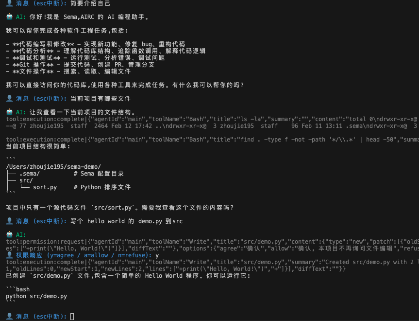

<div align="center">


<h3>An Event-Driven AI Coding Assistant Core Engine</h3>

<p>Providing reliable and pluggable intelligent processing capabilities for building code assistant tools.</p>

[](https://github.com/midea-ai/sema-code-core/blob/main/LICENSE)
[](https://deepwiki.com/midea-ai/sema-code-core)
[](https://www.npmjs.com/package/sema-core)
[](https://midea-ai.github.io/sema-code-core)

[中文](./README_CN.md) | **English**

</div>

## 📖 Project Overview

**Sema Code Core** is an event-driven AI coding assistant core engine that provides reliable and pluggable intelligent processing capabilities for building code assistant tools. It supports core capabilities such as multi-agent collaboration, Skill extension, and Plan mode task planning, and can be quickly integrated into various AI programming tools.

[View Documentation](https://midea-ai.github.io/sema-code-core)

## ✨ Core Features

| Feature | Description |
|:--------|:------------|
| **Natural Language Instructions** | Directly drive programming tasks through natural language |
| **Permission Control** | Fine-grained permission management ensures safe and controllable operations |
| **Subagent Management** | Multi-agent collaboration with dynamic sub-agent scheduling based on task types |
| **Skill Extension Mechanism** | Plugin architecture to flexibly extend AI programming capabilities |
| **Plan Mode Task Planning** | Decomposition and execution planning of complex tasks |
| **MCP Protocol Support** | Built-in Model Context Protocol service to support tool extension |
| **Multi-Model Support** | Compatible with Anthropic, OpenAI SDK, and LLM APIs from major vendors |

## 🎯 Scenarios

- **IDE / Editor Plugin Development** — Provides low-level AI capability encapsulation for editors, allowing developers to focus on UI interaction without self-developing complex large model scheduling and tool calling logic.

- **Enterprise Internal R&D Tools** — Private deployment + permission control, adapting to enterprise-owned models and security specifications. Out-of-the-box toolchain avoids building AI programming infrastructure from scratch.

- **Vertical Domain Intelligent Workflow** — Decomposes complex engineering tasks (migration, refactoring, documentation) into automated processes. Multi-agent collaborative execution replaces manual processing of repetitive coding work.

- **Academic Research & Agent Prototype Verification** — Provides a lightweight Agent experimental environment for academic institutions and independent researchers, supporting flexible combinations of toolchains and agent strategies, allowing researchers to focus on algorithmic innovation.

## 💼 Use Cases

### VSCode Extension

[Sema Code VSCode Extension](https://github.com/midea-ai/sema-code-vscode-extension) is a VSCode intelligent programming plugin based on the Sema Code Core engine.

<p align="center">
  
</p>

### Skill Web App

A Skill web application based on Sema Code Core, integrating Agent Skill Browser / Creator / Playground demo.

<p align="center">
  
</p>

## 🚀 Quick Start

### 1. Create a project and install dependencies

```bash
mkdir my-app && cd my-app
npm init -y
npm install sema-core
```

### 2. Download the example file

Download [quickstart.mjs](https://github.com/midea-ai/sema-code-core/tree/main/example/quickstart.mjs) to the `my-app` directory, then modify the following two configurations:

```js
const core = new SemaCore({
  workingDir: '/path/to/your/project', // Target repository path for the Agent to operate on
  ...
});

const modelConfig = {
  apiKey: 'sk-your-api-key', // Replace with your API Key
  ...
};
```

For more model configuration options, see [Model Management](https://midea-ai.github.io/sema-code-core/#/wiki/getting-started/basic-usage/add-new-model)

### 3. Run

```bash
node quickstart.mjs
```



## 🛠 Development

```bash
# 1. Install dependencies
npm install

# 2. Build
npm run build

# 3. Run tests
node test/addModel.test.js
node test/miniCli.test.js
```


<details>
<summary><strong>ripgrep Cross-Platform Packaging (Mac/Win)</strong></summary>

```bash
# Before the first package, download the dual-platform ripgrep dependency files
./download-ripgrep.sh
```

</details>
