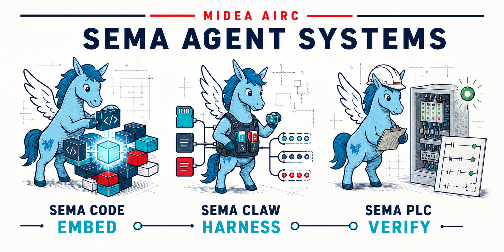

<div align="center">

<picture>
  <source media="(prefers-color-scheme: dark)" srcset="./docs/images/semacode-logo-dark.png">
  <source media="(prefers-color-scheme: light)" srcset="./docs/images/semacode-logo.png">
  
</picture>

<h3>事件驱动型 AI 编程助手核心引擎</h3>

<p>为构建代码助手工具提供可靠、可插拔的智能处理能力</p>

[](https://github.com/midea-ai/sema-code-core/blob/main/LICENSE)
[](https://deepwiki.com/midea-ai/sema-code-core)
[](https://www.npmjs.com/package/sema-core)
[](https://midea-ai.github.io/sema-code-core)
[](https://arxiv.org/abs/2604.11045)

**中文** | [English](./README.md)

</div>

## 📖 项目概述

**Sema Core** 是一个事件驱动型 AI 编程助手核心引擎，为构建代码助手工具提供可靠、可插拔的智能处理能力。支持多智能体协同、Skill 扩展、Plan 模式任务规划等核心能力，可快速集成到各类 AI 编程工具中。

[查看文档](https://midea-ai.github.io/sema-code-core)

## 💼 使用案例

### SemaCode 插件（VSCode / JetBrains）

[SemaCode Extension](https://github.com/midea-ai/sema-code-vscode-extension) 是基于 Sema Core 引擎的智能编程插件，支持 VSCode 插件和 JetBrains 插件（IntelliJ IDEA / PyCharm / GoLand / WebStorm / CLion 等）。

<p align="center">
  
</p>

### SemaWork

[SemaWork](./webui/README.md) 是基于 Sema Core 的本地 Web 界面。

<p align="center">
  
</p>

### SemaPLC

[SemaPLC](https://github.com/midea-ai/SemaPLC) 是工业 PLC 编程 IDE：用自然语言描述控制任务，由内置的 Sema Core Agent 端到端地生成、编译、部署并验证 PLC 程序。

<p align="center">
  
</p>

### SemaClaw 

[SemaClaw](https://github.com/midea-ai/SemaClaw) 是一个通用的工程框架，用于构建个人 AI 代理。

<p align="center">
  
</p>

## 🚀 快速开始

以 [SemaWork](./webui/README.md) 为例，两步在本地跑起来：

### 1. 克隆并构建

```bash
git clone https://github.com/midea-ai/sema-code-core.git
cd sema-code-core && npm install && npm run build
```

### 2. 启动 SemaWork

```bash
cd webui && npm install && npm run build
npm start
```

启动后用浏览器打开终端打印的地址（`http://127.0.0.1:3210/?token=…`）；也可用 `npm start -- --open` 自动打开浏览器。

## 🛠️ 开发

```bash
# 1. 安装依赖
npm install

# 2. 编译
npm run build

# 3. 打包（可选）：生成 sema-core-x.y.z.tgz，可在其他项目中 npm install <tgz> 验证
npm pack
```

非 Node 项目可通过[多语言 SDK](./sdks/README.md)（Java / Python / C#）接入。

<a id="the-sema-family"></a>

## 🌐 The Sema Family

**Midea AIRC · SEMA Agent Systems** 从三个方向探索 Agent 系统工程：**Sema Code** 将编码 Agent 解耦为可编程、可嵌入的基础设施；**SemaClaw** 通过 Harness Engineering 构建开放、可控、可扩展的个人 Agent 系统；**SemaPLC** 面向工业代码生成，以项目上下文以及规格、编译和运行时验证结果约束交付。图中的 **Embed · Harness · Verify** 分别概括三项工作的研究重点，并不表示统一流程或严格依赖关系。

<p align="center">
  
</p>

SEMA 系列目前包含以下论文与开源实现：

[1] [*Sema Code: Decoupling AI Coding Agents into Programmable, Embeddable Infrastructure*](https://arxiv.org/abs/2604.11045) · [代码](https://github.com/midea-ai/sema-code-core)<br>
[2] [*SemaClaw: A Step Towards General-Purpose Personal AI Agents through Harness Engineering*](https://arxiv.org/abs/2604.11548) · [代码](https://github.com/midea-ai/SemaClaw)<br>
[3] [*SemaPLC: A Project-Grounded, Verification-Gated Agent Harness for PLC Code Generation*](https://arxiv.org/abs/2608.18565) · [代码](https://github.com/midea-ai/SemaPLC)

## 📜 许可证

`sema-core` 采用 [MIT 许可证](./LICENSE) 发布，第三方依赖清单及外部服务条款见 [THIRD_PARTY_NOTICES.md](./THIRD_PARTY_NOTICES.md)。

