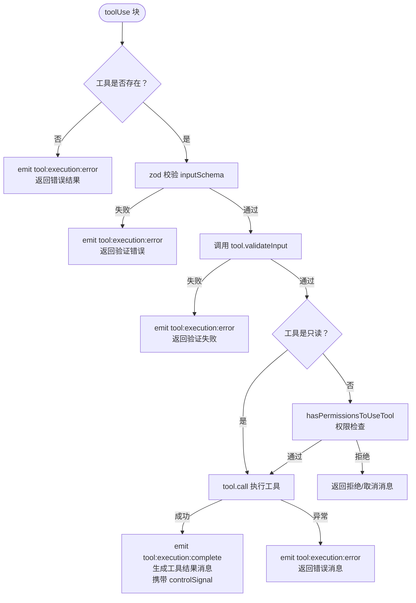
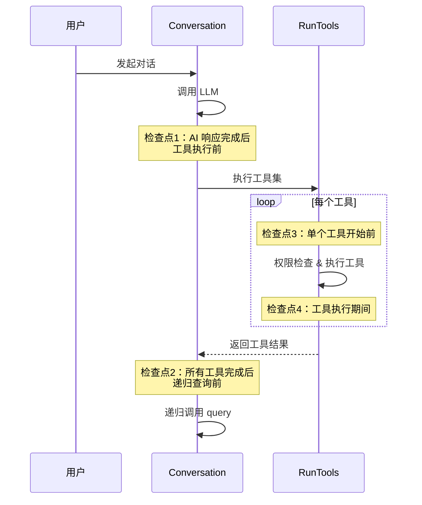

# Conversation — 对话系统

`Conversation` 模块实现了与 LLM 的核心对话循环，是整个 Agent 执行引擎的心脏。

## 核心职责

- 以流式方式调用 LLM API
- 收集并分发 thinking、text、tool_use 响应块
- 决定并执行工具调用（并发或串行）
- 将工具结果反馈给 LLM，继续循环
- 支持中断、上下文压缩、上下文重建


## 入口：SemaEngine 预处理

`query()` 由 `SemaEngine.processQuery()` 调用，在调用前会完成以下预处理：

1. **系统命令处理**：识别并执行 `/` 开头的系统命令（`handleSystemCommand`），命中则不进入 query
2. **自定义命令处理**：检测并展开自定义命令（`tryHandleCustomCommand`），返回处理后的输入
3. **文件引用解析**：提取输入中的文件引用，生成 `systemReminders` 和补充信息（`processFileReferences`）
4. **系统提示词生成**：调用 `formatSystemPrompt`，包含工作目录、规则、Skill 摘要、Plan 模式提示等
5. **additionalReminders 构建**（`buildAdditionalReminders`）：
   - 文件引用 `systemReminders`（每次均添加）
   - 首次查询时（消息历史为空）：Todos 提醒（有 TodoWrite 工具时）、Rules 提醒
   - Plan 模式首次查询时：Plan 模式专用提醒（`generatePlanReminders`，发送后标记避免重复）


## 对话循环

```
用户输入
   │
   ▼
SemaCore.processUserInput(input)
   │
   ▼
SemaEngine.processUserInput()
   ├─ 解析 @文件引用
   ├─ 生成系统提示词
   └─ 触发 Conversation.query()
          │
          ▼
       调用 LLM API（流式）
          ├─ emit message:thinking:chunk
          ├─ emit message:text:chunk
          └─ 收集 tool_use 块
                 │
                 ▼
           执行工具（RunTools）
           ├─ 只读工具 → 并发执行（Promise.all）
           └─ 写入工具 → 串行执行（顺序）
                 │
                 ├─ emit tool:permission:request（需授权时）
                 ├─ emit tool:execution:complete
                 └─ 工具结果 → 返回 LLM
                        │
                        ▼
                   继续对话循环...
                        │
                        ▼（无工具调用时结束）
                   emit message:complete
                   emit state:update { state: 'idle' }

```

> 子代理（subagent）不触发自动压缩，也不发送 `conversation:usage` 事件。


## 工具执行策略

### 并发执行

**条件**：本轮所有工具调用的 `isReadOnly()` 均返回 `true`

```javascript
// 并行执行所有只读工具
const results = await Promise.all(toolCalls.map(tc => executeTool(tc)))
```

**优势**：显著提升多文件读取、多次搜索等场景的性能

**适用工具**：`Read`、`Glob`、`Grep`（均为只读）

### 串行执行

**条件**：本轮存在任意一个 `isReadOnly()` 返回 `false` 的工具

```javascript
// 按 LLM 返回顺序依次执行
for (const toolCall of toolCalls) {
  const result = await executeTool(toolCall)
  results.push(result)
}
```

**优势**：避免写操作之间的竞态条件（如先 Write 再 Edit 同一文件）

**适用工具**：`Bash`、`Write`、`Edit`、`TodoWrite`、`Task` 等

## 工具执行流程

单个工具的执行经过输入验证、权限检查后调用，并通过 EventBus 发布执行结果。




## 中断机制

对话执行过程中设有 4 个检查点，可在以下时机安全中断：



各检查点触发后的行为：

| 检查点 | 位置 | 触发后行为 |
|--------|------|-----------|
| 检查点1 | AI 响应完成，工具执行前 | 追加中断消息到历史，emit `session:interrupted` |
| 检查点2 | 所有工具完成，递归查询前 | 向最后一条工具结果追加中断文本，emit `session:interrupted` |
| 检查点3 | 单个工具开始前 | 返回取消消息（`CANCEL_MESSAGE`） |
| 检查点4 | 工具执行期间 | 拒绝原因为 `refuse` 时保留原消息；其他原因返回取消消息 |

调用 `sema.interruptSession()` 后，会在最近的检查点中止执行，并触发 `session:interrupted` 事件。


## 上下文压缩（Compact）

当对话历史的 token 数量接近模型上下文限制时，自动触发压缩（仅主代理，子代理跳过）：

```
当前 token 数 > contextLength * 压缩阈值
        │
        ▼
调用 LLM 对历史对话进行摘要压缩
        │
        ▼
用摘要替换原始历史（保留最近几轮）
        │
        ▼
emit compact:exec { tokenBefore, tokenCompact, compactRate }
```

压缩后对话继续正常进行，对用户透明。


## 上下文重建

当 AI 调用 `ExitPlanMode` 工具时，触发上下文重建流程（`handleControlSignalRebuild`）：

```javascript
// ExitPlanMode 返回的控制信号
controlSignal: {
  rebuildContext: {
    reason: 'mode_changed'
    newMode: 'Agent'
    rebuildMessage?: MessageContent[]  // clearContextAndStart 时使用
  }
}
```

重建步骤：

1. 检测到 `controlSignal.rebuildContext`
2. 重新构建工具列表（`newMode` 为 `'Agent'` 时加入 `TodoWrite`）
3. 重新生成系统提示词（不含 Plan 模式提示）
4. 根据 `rebuildMessage` 决定消息历史：
   - **无 rebuildMessage**（startEditing）：保留原消息历史，继续对话
   - **有 rebuildMessage**（clearContextAndStart）：清空历史，以含 todos/rules 提醒的新消息重新开始


## Token 追踪

每轮 AI 响应后及中断时均发布 token 使用情况（仅主代理触发）：

```javascript
sema.on('conversation:usage', ({ usage }) => {
  console.log(`已用: ${usage.useTokens} / ${usage.maxTokens}`)
  console.log(`Prompt tokens: ${usage.promptTokens}`)
})
```
