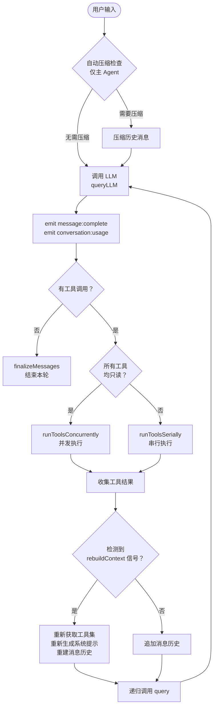

# 引言：Agent 基础

## 什么是 Agent

Agent（代理）是能够感知环境、做出决策并采取行动的 AI 系统。与简单的问答 AI 不同，Agent 能够：

- **调用工具**：读写文件、执行命令、搜索代码、调用外部 API
- **多步推理**：将复杂任务分解为多个步骤，逐步执行
- **感知结果**：观察工具执行结果，据此调整后续行动
- **循环执行**：重复"思考 → 行动 → 观察"直到完成目标

## Sema Agent 工作原理

每轮对话循环包含：

1. **调用 LLM**：发送消息历史和工具定义，获取流式响应
2. **收集响应**：接收 thinking 内容、text 内容、tool_use 块
3. **执行工具**：按并发/串行策略执行所有工具调用
4. **汇总结果**：将工具结果追加到消息历史
5. **继续循环**：重复直到 LLM 不再发起工具调用

