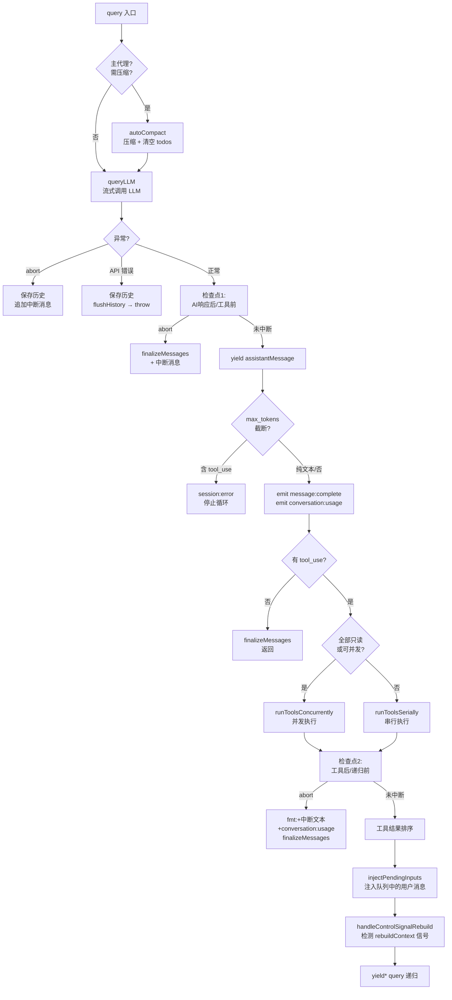

# 引言：Agent 基础

## 什么是 Agent

Agent（代理）是能够感知环境、做出决策并采取行动的 AI 系统。与简单的问答 AI 不同，Agent 能够：

- **调用工具**：读写文件、执行命令、搜索代码、调用外部 API
- **多步推理**：将复杂任务分解为多个步骤，逐步执行
- **感知结果**：观察工具执行结果，据此调整后续行动
- **循环执行**：重复“思考 → 行动 → 观察”直到完成目标

## 核心架构概述

Sema Core 的核心架构采用进程级门面 + 会话级门面的两层 API：

- **SemaCore**：进程级入口，管理全局配置、模型、MCP、插件、Cron、会话池和进程级事件
- **SemaSession**：会话级入口，处理用户输入、会话事件、权限响应、中断、模式切换和后台任务
- **SemaEngine**：单会话业务逻辑引擎，每个 `SemaSession` 持有一个，绑定固定 `sessionId`

上层应用（VSCode 插件、CLI、Web App）通常先创建 `SemaCore`，再通过 `core.createSession()` 获取 `SemaSession` 并进行对话。

## 分层结构

```
┌─────────────────────────────────────────────┐
│  SemaCore                                   │
│  进程级 API 门面                              │
│  · 会话池（create/get/list/close session）   │
│  · 进程级事件（cron / mcp）                  │
│  · 模型/配置/MCP/Agent/Skill/Command/       │
│    Plugin/Memory/Rule 管理                   │
│  · dispose 释放全局资源                       │
└──────────────┬──────────────────────────────┘
               │ createSession()
┌──────────────▼──────────────────────────────┐
│  SemaSession                                │
│  会话级 API 门面                              │
│  · processUserInput / interrupt             │
│  · session.on / once / off                  │
│  · respondToToolPermission / Pick / Plan    │
│  · updateAgentMode / updateAutoEdit         │
│  · 会话级后台任务管理                         │
└──────────────┬──────────────────────────────┘
               │ 持有
┌──────────────▼──────────────────────────────┐
│  SemaEngine                                 │
│  单会话业务逻辑引擎                            │
│  · 输入队列（处理中排队/命令提取）              │
│  · 查询编排（命令→文件引用→提示快照→对话循环）   │
│  · AbortController 中断                      │
│  · Task/Cron 通知回调                         │
└──────────────┬──────────────────────────────┘
               │ 调用
┌──────────────▼──────────────────────────────┐
│  Conversation.query()                       │
│  对话循环（异步生成器）                        │
│  · LLM 流式调用                              │
│  · 工具执行编排（并发/串行）                   │
│  · 上下文压缩 & 重建                          │
│  · 中断检查点                                │
└─────────────────────────────────────────────┘
```

## API 分工

### SemaCore

`SemaCore` 负责进程级能力：

| 功能域 | 方法 | 说明 |
|--------|------|------|
| 会话池 | `createSession` / `getSession` / `listSessions` / `setActiveSession` / `closeSession` | 创建、查找、切换 UI 活跃会话、关闭会话 |
| 进程级事件 | `on` / `once` / `off` | 订阅 `cron:update`、`mcp:server:status` |
| 模型 | `addModel` / `delModel` / `switchModel` / `applyTaskModel` / `getModelData` | 模型 CRUD |
| 配置 | `updateCoreConfByKey` / `updateCoreConfig` / `updateDisabledTools` | 运行时核心配置调整 |
| 工具 | `fetchAvailableModels` / `testApiConnection` / `getModelAdapter` / `getToolInfos` | 独立工具函数与工具信息 |
| 插件市场 | `addMarketplaceFromGit` ~ `uninstallPlugin` | 插件市场完整管理 |
| Agent | `getAgentsInfo` / `addAgentConf` / `removeAgentConf` | 子代理配置管理 |
| Skill | `getSkillsInfo` / `removeSkillConf` | Skill 配置管理 |
| Command | `getCommandsInfo` / `addCommandConf` / `removeCommandConf` | 命令配置管理 |
| MCP | `getMCPServerInfo` / `refreshMCPServerInfo` ~ `updateMCPUseTools` | MCP 服务器管理 |
| Memory/Rule | `getMemoryInfo` / `getRuleInfo` | 记忆与规则配置 |
| Cron | `getCronTasks` / `deleteCronTask` / `enableCronTask` / `disableCronTask` | 进程级定时任务管理 |
| 资源 | `dispose` | 关闭所有会话并释放全局单例资源 |

### SemaSession

`SemaSession` 负责会话内能力：

| 功能域 | 方法 | 说明 |
|--------|------|------|
| 用户输入 | `processUserInput` | 发送用户消息；处理中自动进入当前会话队列 |
| 中断 | `interrupt` | 中断当前会话正在执行的请求 |
| 会话级事件 | `on` / `once` / `off` | 订阅消息流、状态、权限请求、工具执行、任务事件等 |
| 交互响应 | `respondToToolPermission` / `respondToPickOption` / `respondToPlanExit` | 回应当前会话中的等待事件 |
| 会话配置 | `updateAgentMode` / `updateAutoEdit` | 调整当前会话模式和自动编辑状态 |
| 后台任务 | `getTaskList` / `watchTask` / `stopTask` / `stopAllTasks` / `transferAgentToBackground` | 管理当前会话的后台任务 |
| 资源 | `dispose` | 清理当前会话资源 |

## SemaEngine

`SemaEngine` 是真正的单会话业务核心，负责：

**会话初始化**

- 加载指定 `sessionId` 的历史，或创建新会话
- 恢复消息历史、Todos、TodoTasks 和文件读取时间戳
- 构建会话级系统提示快照
- 发送 `session:ready`

**输入队列**

处理中收到的新输入按类型进入当前会话队列：

- `/` 开头的命令 → `command` 类型，逐条单独处理
- 普通文本 → `inject` 类型，可合并处理，也会实时注入工具结果中

**查询编排**

1. `handleCommand(input, sessionId)` 解析系统/自定义命令
2. `detectTopicInBackground` 后台话题检测
3. `processFileReferences` 解析 `@文件` 引用
4. 读取会话级系统提示快照
5. `buildAdditionalReminders` 组装提醒（Todos、文件引用、Plan 提示）
6. 调用 `Conversation.query()` 进入对话循环

**调度闭环**

`processQuery.finally` 中自动消费当前会话 `pendingUserInputs` 队列的下一批输入；如果没有剩余输入，则将当前会话状态设为 `idle`。

## 对话循环（Conversation.query）

`query()` 是一个基于异步生成器的递归函数，是整个 Agent 推理的核心：


```mermaid
flowchart TD
    A[query 入口] --> B{主代理?\n需压缩?}
    B -- 是 --> C[autoCompact\n压缩 + 清空 todos]
    B -- 否 --> D
    C --> D[queryLLM\n流式调用 LLM]
    D --> E{异常?}
    E -- abort --> F[保存历史\n追加中断消息]
    E -- API 错误 --> G[保存历史\nflushHistory → throw]
    E -- 正常 --> H[检查点1:\nAI响应后/工具前]
    H -- abort --> I[finalizeMessages\n+ 中断消息]
    H -- 未中断 --> J[yield assistantMessage]
    J --> K{max_tokens\n截断?}
    K -- 含 tool_use --> L[session:error\n停止循环]
    K -- 纯文本/否 --> M[emit message:complete\nemit conversation:usage]
    M --> N{有 tool_use?}
    N -- 否 --> O[finalizeMessages\n返回]
    N -- 是 --> P{全部只读\n或可并发?}
    P -- 是 --> Q[runToolsConcurrently\n并发执行]
    P -- 否 --> R[runToolsSerially\n串行执行]
    Q --> S[检查点2:\n工具后/递归前]
    R --> S
    S -- abort --> T[fmt:+中断文本\n+conversation:usage\nfinalizeMessages]
    S -- 未中断 --> U[工具结果排序]
    U --> V[injectPendingInputs\n注入队列中的用户消息]
    V --> W[handleControlSignalRebuild\n检测 rebuildContext 信号]
    W --> X[yield* query 递归]
```

**4 个中断检查点**分布在关键位置，确保 `session.interrupt()` 后尽快停止：

| 检查点 | 位置 | 触发后行为 |
|--------|------|-----------|
| 0（前置）| `queryLLM` 抛出异常 | abort 时追加中断消息后保存；API 错误仅保存 |
| 1 | AI 响应完成、工具执行前 | 移除含 tool_use 的响应，追加中断消息 |
| 2 | 工具执行完成、递归前 | 在最后工具结果中追加中断文本 |
| 3/4 | 工具执行期间（RunTools 内部） | 返回取消消息 |

**工具执行策略**：

- **并发**：本轮所有工具 `isSafe()` 或 `canRunConcurrently()` → `runToolsConcurrently`
- **串行**：存在任一非安全且不可并发的工具 → `runToolsSerially`（避免写竞态）

**上下文压缩**：

当消息历史 token 超过阈值时，主代理先清理当前 sessionId 的 `TaskManager` 任务，自动调用 `autoCompact` 进行 LLM 摘要式压缩，`autoCompact` 返回后，会清空主代理的`todos` 和 `readFileTimestamps`。子代理不执行压缩。

**上下文重建**：

当 PlanToAgent 等工具执行结果携带 `controlSignal.rebuildContext` 时，重新获取工具集，并可选择清空历史重新开始。
