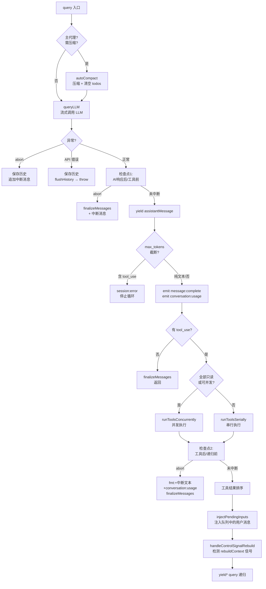

# 引言：Agent 基础

## 什么是 Agent

Agent（代理）是能够感知环境、做出决策并采取行动的 AI 系统。与简单的问答 AI 不同，Agent 能够：

- **调用工具**：读写文件、执行命令、搜索代码、调用外部 API
- **多步推理**：将复杂任务分解为多个步骤，逐步执行
- **感知结果**：观察工具执行结果，据此调整后续行动
- **循环执行**：重复"思考 → 行动 → 观察"直到完成目标

## 核心架构概述

Sema Core 的核心架构遵循**门面（Facade）**设计模式，分为两个关键层次：

- **SemaCore**：对外暴露的公共 API 入口，封装内部复杂度
- **SemaEngine**：核心业务逻辑引擎，负责会话调度、输入队列、查询编排

上层应用（VSCode 插件、CLI、Web App）只与 `SemaCore` 交互，引擎内部的复杂逻辑对其完全透明。


## 两层架构

```
┌─────────────────────────────────────────────┐
│  SemaCore                                   │
│  公共 API 门面层                              │
│  · 事件（on/once/off）                       │
│  · 会话（createSession/processUserInput）    │
│  · 模型/配置/工具/MCP/Agent/Skill/           │
│    Command/Plugin/Memory/Rule 管理           │
│  · 任务/Cron/中断/dispose                    │
└──────────────┬──────────────────────────────┘
               │ 委托（delegate）
┌──────────────▼──────────────────────────────┐
│  SemaEngine                                 │
│  业务逻辑引擎                                 │
│  · 会话生命周期（初始化/创建/切换）            │
│  · 输入队列（处理中排队/命令提取）              │
│  · 查询编排（命令处理→文件引用→系统提示→对话循环）│
│  · 中断 & 待处理会话管理                      │
└──────────────┬──────────────────────────────┘
               │ 调用
┌──────────────▼──────────────────────────────┐
│  Conversation.query()                       │
│  对话循环（异步生成器）                        │
│  · LLM 流式调用                              │
│  · 工具执行编排（并发/串行）                   │
│  · 上下文压缩 & 重建                          │
│  · 中断检查点                                │
└─────────────────────────────────────────────┘
```

### SemaCore

`SemaCore` 是外部使用的唯一入口。它本身不包含业务逻辑，所有请求委托给内部 `SemaEngine` 实例或各 Manager 单例。其 API 按功能域分组：

| 功能域 | 方法 | 说明 |
|--------|------|------|
| 事件 | `on` / `once` / `off` | 订阅/取消订阅事件 |
| 事件响应 | `respondToToolPermission` / `respondToPickOption` / `respondToPlanExit` | 用户对 Agent 请求的响应 |
| 会话 | `createSession` / `processUserInput` | 创建会话、发送用户输入 |
| 中断 | `interruptSession` | 立即中断当前对话 |
| 模型 | `addModel` / `delModel` / `switchModel` / `applyTaskModel` / `getModelData` | 模型 CRUD |
| 配置 | `updateCoreConfByKey` / `updateCoreConfig` / `updateUseTools` / `updateAgentMode` / `updateAutoEdit` | 运行时配置调整 |
| 工具 | `fetchAvailableModels` / `testApiConnection` / `getModelAdapter` | 独立工具函数 |
| 插件市场 | `addMarketplaceFromGit` ~ `uninstallPlugin`（10 个方法） | 插件市场完整管理 |
| Agent | `getAgentsInfo` / `addAgentConf` / `removeAgentConf` | 子代理配置管理（`getAgentsInfo` 支持 `refresh` 参数） |
| Skill | `getSkillsInfo` / `removeSkillConf` | Skill 配置管理（`getSkillsInfo` 支持 `refresh` 参数） |
| Command | `getCommandsInfo` / `addCommandConf` / `removeCommandConf` | 命令配置管理（`getCommandsInfo` 支持 `refresh` 参数） |
| MCP | `getMCPServerInfo` / `refreshMCPServerInfo` ~ `updateMCPUseTools`（9 个方法） | MCP 服务器管理 |
| Memory/Rule | `getMemoryInfo` / `getRuleInfo` | 记忆与规则配置（均支持 `refresh` 参数） |
| Task/Cron | `getTaskList` / `watchTask` / `stopTask` 等 + Cron 管理 | 后台 & 定时任务 |
| 资源 | `dispose` | 清理所有单例资源 |

### SemaEngine

`SemaEngine` 是真正的业务核心，负责：

**会话生命周期**
- `createSession(sessionId?)`：初始化会话。若当前正处理旧会话，排队等待（最多 10 秒）后自动切换
- `processUserInput(input)`：入口，处理中时入队，否则启动查询

**输入队列**
处理中收到的新输入按类型入队：
- `/` 开头的命令 → `command` 类型，逐条单独处理
- 普通文本 → `inject` 类型，可合并处理，也会实时注入工具结果中

**查询编排**（`processQuery`）
1. 调用 `handleCommand` 解析系统/自定义命令
2. `detectTopicInBackground` 后台话题检测
3. `processFileReferences` 解析 `@文件` 引用
4. `formatSystemPrompt` 构建系统提示词（含 Memory、Rule、Skill、Plan 模式等）
5. `buildAdditionalReminders` 组装提醒（Todos、文件引用、Plan 提示）
6. 调用 `Conversation.query()` 进入对话循环

**调度闭环**
`processQuery.finally` 中自动：
- 优先处理 `pendingSession`（会话切换）
- 否则消费 `pendingUserInputs` 队列的下一批输入


## 对话循环（Conversation.query）

`query()` 是一个基于异步生成器的递归函数，是整个 Agent 推理的核心：


```mermaid
flowchart TD
    A[query 入口] --> B{主代理?\n需压缩?}
    B -- 是 --> C[autoCompact\n压缩 + 清空 todos]
    B -- 否 --> D
    C --> D[queryLLM\n流式调用 LLM]
    D --> E{异常?}
    E -- abort --> F[保存历史\n追加中断消息]
    E -- API 错误 --> G[保存历史\nflushHistory → throw]
    E -- 正常 --> H[检查点1:\nAI响应后/工具前]
    H -- abort --> I[finalizeMessages\n+ 中断消息]
    H -- 未中断 --> J[yield assistantMessage]
    J --> K{max_tokens\n截断?}
    K -- 含 tool_use --> L[session:error\n停止循环]
    K -- 纯文本/否 --> M[emit message:complete\nemit conversation:usage]
    M --> N{有 tool_use?}
    N -- 否 --> O[finalizeMessages\n返回]
    N -- 是 --> P{全部只读\n或可并发?}
    P -- 是 --> Q[runToolsConcurrently\n并发执行]
    P -- 否 --> R[runToolsSerially\n串行执行]
    Q --> S[检查点2:\n工具后/递归前]
    R --> S
    S -- abort --> T[fmt:+中断文本\n+conversation:usage\nfinalizeMessages]
    S -- 未中断 --> U[工具结果排序]
    U --> V[injectPendingInputs\n注入队列中的用户消息]
    V --> W[handleControlSignalRebuild\n检测 rebuildContext 信号]
    W --> X[yield* query 递归]
```

**4 个中断检查点**分布在关键位置，确保 `interruptSession()` 后尽快停止：

| 检查点 | 位置 | 触发后行为 |
|--------|------|-----------|
| 0（前置）| `queryLLM` 抛出异常 | abort 时追加中断消息后保存；API 错误仅保存 |
| 1 | AI 响应完成、工具执行前 | 移除含 tool_use 的响应，追加中断消息 |
| 2 | 工具执行完成、递归前 | 在最后工具结果中追加中断文本 |
| 3/4 | 工具执行期间（RunTools 内部） | 返回取消消息 |

**工具执行策略**：
- **并发**：本轮所有工具 `isSafe()` 或 `canRunConcurrently()` → `runToolsConcurrently`
- **串行**：存在任一非安全且不可并发的工具 → `runToolsSerially`（避免写竞态）

**上下文压缩**（仅主代理）：
当消息历史 token 超过阈值时，自动调用 `autoCompact` 进行 LLM 摘要式压缩，同时清理 `TaskManager` 后台进程、清空 `todos` 和 `readFileTimestamps`。

**上下文重建**：
当 PlanToAgent 等工具执行结果携带 `controlSignal.rebuildContext` 时，重新获取工具集、重新生成系统提示词，并可选择清空历史重新开始。
