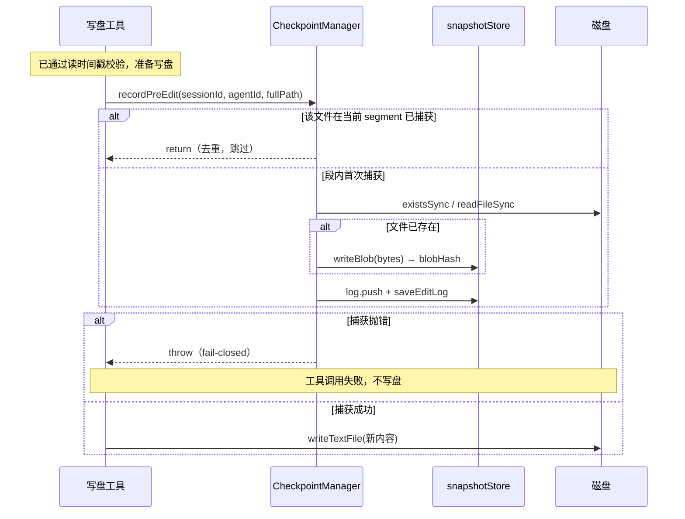
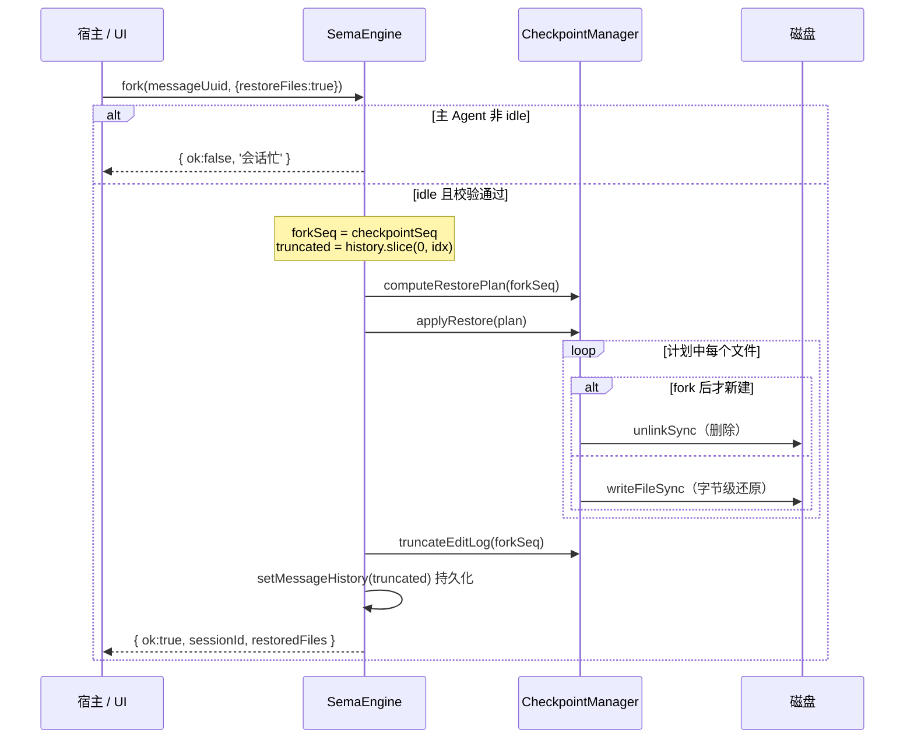

# 会话 Fork / 代码回滚

**Fork（原地回退 / 撤销）** 允许选中会话历史中的某一条**真实用户输入消息**，把会话回退到「发送该消息之前」的状态，并**可选地把工作区文件一并还原到那一刻的内容**。

它解决的问题：AI 在多轮对话中改坏了代码或走错方向时，回到某个干净的回合边界重新来过，既不必手工撤销一堆文件改动，也不必新开会话丢掉上下文。

设计上有两个关键定位：

- **原地回退，不分叉**：回退后 `sessionId` 不变，同一会话继续使用。历史就地截断，被撤销的轮次与其快照记录一并丢弃。
- **文件回滚是可选项**：
  - `restoreFiles: false`（默认）— 仅回退**对话历史**（fork-only），不动磁盘文件。
  - `restoreFiles: true` — 回退历史的同时，把 fork 点之后被改动 / 新建 / 删除的文件**字节级还原**到 fork 点状态。

文件回滚机制**独立于 git**，基于自建的「改动前镜像」日志（EditLog）+ 内容寻址 blob 仓库实现，对未纳入版本控制的项目同样有效。

## 核心概念

| 术语 | 含义 |
|------|------|
| Fork 点 | 选中的一条真实用户输入消息。回退会移除该消息**及其之后**的所有历史 |
| `checkpointSeq` | 打在真实用户输入消息上的锚点，记录"该输入发送时本会话已累积的文件快照记录数"，连接「会话历史」与「文件快照」 |
| EditLog | 每会话一份的追加日志，每条记录是某文件在某个 turn-segment 内的"改动前镜像"指针（`EditRecord`） |
| blob | 文件改动前的原始字节，以 SHA-256 内容寻址存储，跨会话天然去重 |
| turn-segment | 两次用户输入之间的执行区间。每段开始 `beginTurn` 记录段起点；"每文件每段只捕一次"以段为单位去重 |
| fail-closed | 捕获快照失败时令本次写盘工具调用失败（不写盘），宁可不改也不留下无法回滚的改动 |
| fork-only | 只回退历史、不还原文件（旧历史消息无锚点时也只能做到这一步） |

## 整体架构

分层清晰，依赖单向向下，存储层不反向依赖任何 manager（避免循环依赖）。

| 层 | 位置 | 职责 |
|----|------|------|
| 对外 API | `SemaSession` | `getForkPreview` 预览、`fork` 执行回退 |
| 业务编排 | `SemaEngine` | `startQuery` 打锚点；`rewind` idle 守卫 → 校验 → 回滚文件 → 截断 editlog / 历史 |
| 快照管理（单例） | `CheckpointManager` | `beginTurn` / `recordPreEdit` / `preview` / `computeRestorePlan` / `applyRestore` / `truncateEditLog` / `forgetSession` |
| 存储层（纯 IO） | `util/snapshotStore` | blob 仓库、EditLog 持久化、退场 GC |

**捕获接入点**：`WriteFile`、`PatchFile`、`EditNotebook` 在真正写盘**之前**调用 `CheckpointManager.recordPreEdit(...)`。

## 数据模型

EditLog 中的一条记录（`src/util/snapshotStore.ts`）：

```typescript
interface EditRecord {
  seq: number;             // 本会话 EditLog 中的序号 = 追加时的数组下标（单调递增）
  agentId: string;         // 'main' 或子代理 taskId（仅作归属标记）
  filePath: string;        // 绝对路径
  blobHash: string | null; // 旧内容 blob 的 sha256；新建文件（existedBefore=false）时为 null
  existedBefore: boolean;  // 改动前文件是否已存在
  ts: number;
}
```

会话历史侧的锚点（`src/types/message.ts`）。锚点只打在**真实用户输入**上；工具结果、中断提示、上下文重建 / 压缩通知等合成 user 消息都不带：

```typescript
interface UserMsg {
  // ...
  checkpointSeq?: number;  // 缺失 → 不可作为"恢复文件"的 fork 点
}
```

对外契约类型（`src/types/fork.ts`）：

```typescript
// 单文件回滚语义
type ForkFileEffect =
  | 'modify'    // fork 后被改过 → 覆盖回旧内容
  | 'recreate'  // fork 后被删了 → 重新写回旧内容
  | 'delete';   // fork 之后才新建 → 删除以回到 fork 态

interface ForkFileChange {
  filePath: string;
  displayPath: string;     // 相对工作目录的展示路径
  effect: ForkFileEffect;
  additions: number;       // 执行回滚将新增的行数
  removals: number;        // 执行回滚将删除的行数
  binary?: boolean;        // 二进制文件不计增删行
}

interface ForkPreview {
  messageUuid: string;
  canRestoreFiles: boolean;  // 该消息是否带快照锚点（旧历史可能没有 → 只能 fork-only）
  files: ForkFileChange[];
}

interface ForkOptions {
  restoreFiles?: boolean;    // true 时同时把文件回滚到 fork 点
}

type ForkResult =
  | { ok: true;  sessionId: string; restoredFiles: string[] }
  | { ok: false; error: string };
```

## 存储布局

快照根目录位于 `~/.sema/snapshots/`，按项目分目录（与 history 共用同一套"项目路径 → 目录名"命名规则，仅根目录不同）。

```
~/.sema/snapshots/<project>/
├── blobs/<sha256>              # 文件改动前的原始字节，内容寻址，跨会话去重
└── <sessionId>.editlog.json    # 每会话的 EditLog，格式：{ "records": EditRecord[] }
```

- 项目目录名规则（`getProjectDirName`）：路径分隔符替换为 `-`、开头补 `-`、去掉 Windows 盘符冒号，例如 `/Users/x/proj` → `-Users-x-proj`。
- blob 用内容哈希命名，相同内容只存一份；写入前先判存在性，已存在则跳过。

## 核心流程

### 打锚点

`SemaEngine.startQuery()` 在每批用户输入发送前调用 `beginTurn`，并把返回值打在每条 `UserMsg` 上：

```typescript
const checkpointSeq = getCheckpointManager().beginTurn(this.sessionId);
// beginTurn: 返回当前 EditLog 长度，并把它设为本 segment 起点
// 随后 msg.checkpointSeq = checkpointSeq（同批多条输入共享同一锚点）
```

### 捕获改动前镜像（fail-closed）

`CheckpointManager.recordPreEdit()` 由写盘工具在写盘前调用：

1. **段内去重**：该文件在当前 segment（`seq >= segStart`）已捕获过则直接返回，只留**段起始镜像**。
2. 读取当前内容：文件存在 → `writeBlob(原始字节)` 得 `blobHash`、`existedBefore=true`；文件不存在 → `blobHash=null`、`existedBefore=false`。
3. 追加 `EditRecord` 并持久化 EditLog。
4. **fail-closed**：任何步骤抛错都向上抛出，使本次工具调用失败、不写盘——保证"凡是落了盘的改动，必有可回滚的镜像"。

### 预览（只读）

`CheckpointManager.preview()` 据 `messageUuid` 取出 `checkpointSeq`（= forkSeq），计算回滚集并逐文件描述改动：

- **回滚集 `computeRestorePlan`**：所有 `seq >= forkSeq` 的记录中，每个文件取 seq 最早一条（代表它在 fork 点时的状态）。
- **单文件 effect 判定**：

| 镜像状态 (`existedBefore`) | 当前磁盘态 | effect | 增删行 |
|---|---|---|---|
| 否（fork 后才新建） | 任意 | `delete` | removals = 当前行数 |
| 是 | 当前已不存在（被删） | `recreate` | additions = 旧内容行数 |
| 是 | 当前存在 | `modify` | 按 diff 计算 |

消息不存在或无锚点时返回 `{ canRestoreFiles: false, files: [] }`（只能 fork-only）；二进制文件不计增删行。

### 执行回退

`SemaEngine.rewind()`（经 `SemaSession.fork` 委托）：

1. **idle 守卫**：主 Agent 非 idle 直接返回 `会话忙`（处理中回退会导致 editlog / history / 磁盘不一致）。
2. **校验 fork 点**：必须是 `type==='user'` 且带 `checkpointSeq` 的真实用户输入，否则报错。
3. 计算 `forkSeq` 与 `truncated = history.slice(0, idx)`（移除该消息及其之后）。
4. （仅 `restoreFiles`）`computeRestorePlan` → `applyRestore` 回滚文件，并刷新被回滚文件的读时间戳（避免触发"先重读"）。
5. `truncateEditLog(forkSeq)` 丢弃被撤销轮次的快照记录。
6. `setMessageHistory(truncated)` 并持久化（空历史时强制落盘覆盖）。
7. 重发一次 `todos:update`（todos 不随回档回退，重发让 UI 面板同步）。

**回滚执行 `applyRestore`**：`existedBefore=false`（fork 后才新建）→ 删除文件（已被删则忽略 ENOENT）；`existedBefore=true` → `readBlob` 取回旧字节，递归建目录后 `writeFileSync` 字节级整文件还原。

### 时序图

捕获改动前镜像（fail-closed）：



执行回退（`fork`，以 `restoreFiles:true` 为例）：



## 关键设计决策

| 决策 | 理由 |
|------|------|
| fail-closed | 捕获失败让写盘失败。"改了盘却没镜像"会破坏回滚保证，宁可这次不改 |
| 每文件每 segment 只捕一次 | 只需保留进入本段前的内容即可回到 fork 点；省存储，且取"最早一条"即得 fork 点态 |
| 字节级整文件还原 | 用旧字节整文件覆盖 / 删除 / 重写，简单确定，不受外部改动干扰，天然支持二进制 |
| 内容寻址 blob | 相同内容只存一份，跨会话、跨回合共享 |
| 只允许真实用户输入作 fork 点 | 在工具结果 / 合成 user 消息上截断会把上一条 assistant 的 `tool_use` 留成孤儿，静默破坏会话历史 |
| idle 守卫 | 处理中回退会与正在进行的写盘 / 历史更新竞争，造成三者不一致 |
| 原地回退（同 sessionId） | 符合"撤销重来"直觉，避免会话爆炸式分裂 |
| 子代理改动纳入同一 EditLog | 子代理继承父会话 `sessionId`，其改动写入同一 EditLog，主会话 fork 时一并回滚 |

## 退场与清理

`cleanupProjectSnapshots()` 由 `history.cleanupOldHistoryFiles` 在历史文件清理之后调用（`saveHistory` 内每小时最多触发一次），采用**标记清除**：

1. 扫描剩余历史文件，收集仍存活的 `sessionId`（文件名形如 `YYYY-MM-DD_<sessionId>.json`）。
2. 删除非存活会话的 `<sessionId>.editlog.json`（无主 editlog）。
3. 收集剩余 editlog 引用到的 `blobHash` 集合，删除 `blobs/` 下无引用的 blob。

即 editlog 生命周期跟随会话历史，blob 生命周期跟随 editlog 引用。会话关闭时 `SemaSession.dispose()` 调 `forgetSession()` 仅释放**内存**中的 EditLog，磁盘文件保留供再次打开 / fork。

## 边界与限制

- **不处理外部修改冲突**：回滚是无条件字节级覆盖，不检测 fork 点之后文件是否被外部改动。
- **旧历史无锚点只能 fork-only**：早于本机制上线的历史消息没有 `checkpointSeq`，无法还原文件。
- **回滚粒度是整文件**：不支持只回滚文件内某几行。
- **快照仅覆盖三类写盘工具**：`WriteFile` / `PatchFile` / `EditNotebook`；通过 `RunShell` 执行脚本产生的文件改动**不在快照范围内**。
- **todos 不回退**。
- **二进制文件**能回滚（字节级），但预览不计增删行。

## 对外 API

```typescript
// SemaSession（src/core/SemaSession.ts）
session.getForkPreview(messageUuid: string): ForkPreview
session.fork(messageUuid: string, options?: ForkOptions): Promise<ForkResult>
```

典型调用流程（宿主 / UI）：

1. 用户在历史中选中某条用户消息。
2. `getForkPreview(uuid)`：`canRestoreFiles=false` → 只提供"仅回退对话"；`true` → 展示 `files` 改动清单，让用户勾选是否还原文件。
3. `fork(uuid, { restoreFiles })`。
4. 据 `ForkResult`：`ok=true` 用 `restoredFiles` 提示已还原文件，会话继续（`sessionId` 不变）；`ok=false` 提示 `error`。

类型从包入口 `src/index.ts` 导出：`ForkPreview` / `ForkFileChange` / `ForkFileEffect` / `ForkOptions` / `ForkResult`。

## 代码位置索引

| 模块 | 文件 |
|------|------|
| 对外契约类型 | `src/types/fork.ts` |
| 历史侧锚点字段 | `src/types/message.ts`（`UserMsg.checkpointSeq`） |
| 快照管理（核心逻辑） | `src/manager/CheckpointManager.ts` |
| 存储层（纯 IO） | `src/util/snapshotStore.ts` |
| 打锚点 / 执行回退 | `src/core/SemaEngine.ts`（`startQuery` / `rewind`） |
| 对外封装 | `src/core/SemaSession.ts`（`getForkPreview` / `fork` / `forgetSession`） |
| 捕获接入点 | `src/tools/WriteFile.ts`、`src/tools/PatchFile.ts`、`src/tools/EditNotebook.ts` |
| 子代理会话继承 | `src/tools/SubAgent.ts` |
| 退场 GC 触发 | `src/util/history.ts`（`cleanupOldHistoryFiles`） |
| 路径规则 | `src/util/savePath.ts` |
