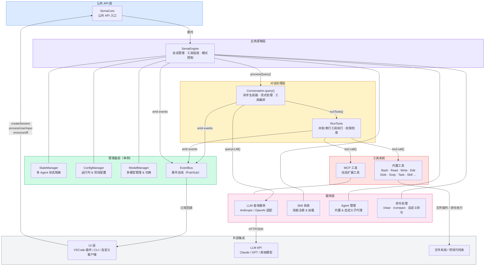

# 架构设计

## 设计原则

Sema Code Core 采用以下核心设计原则：

- **事件驱动**：所有状态变化通过事件总线传播，消费方只需订阅感兴趣的事件
- **模块化分层**：清晰的层次划分，各层职责单一、边界明确
- **可插拔扩展**：工具、模型、Skill、SubAgent、MCP 均支持动态注册与替换
- **状态隔离**：主 Agent 与 SubAgent 各自维护独立的消息历史和运行状态


## 整体架构




## 目录结构

```
src/
├── core/                   # 核心对话引擎
│   ├── SemaCore.ts         # 公共 API 外观层
│   ├── SemaEngine.ts       # 业务逻辑引擎
│   ├── Conversation.ts     # AI 对话循环（异步生成器）
│   └── RunTools.ts         # 工具执行（并发/串行策略）
│
├── tools/                  # 工具系统
│   ├── base/
│   │   ├── Tool.ts         # 工具基础接口
│   │   └── tools.ts        # 工具注册表与构建器
│   ├── Bash/               # 终端执行工具
│   ├── Glob/               # 文件搜索工具
│   ├── Grep/               # 文本搜索工具
│   ├── Read/               # 文件读取工具
│   ├── Write/              # 文件写入工具
│   ├── Edit/               # 文件编辑工具
│   ├── NotebookEdit/       # Notebook 编辑工具
│   ├── TodoWrite/          # 任务规划工具
│   ├── Task/               # 子代理工具
│   ├── Skill/              # Skill 调用工具
│   ├── AskUserQuestion/    # 用户交互工具
│   └── ExitPlanMode/       # 退出 Plan 模式工具
│
├── services/               # 服务层
│   ├── api/                # LLM API 交互
│   ├── mcp/                # MCP 协议集成
│   ├── skill/              # Skill 系统
│   ├── agents/             # SubAgent 管理
│   ├── command/            # 自定义命令
│   └── plugins/            # 插件系统
│
├── manager/                 # 管理器层（单例）
│   ├── StateManager.ts      # 会话状态（支持 agentId 隔离）
│   ├── ConfManager.ts       # 核心配置 + 项目配置
│   ├── ModelManager.ts      # 模型配置与切换
│   └── PermissionManager.ts # 工具执行权限
│
├── events/                 # 事件系统
│   ├── EventSystem.ts      # 事件总线（单例）
│   └── types.ts            # 事件类型定义
│
├── types/                   # TypeScript 类型定义
├── util/                    # 工具函数（20+ 文件）
└── constants/               # 配置常量
```

## 数据流

用户输入到响应输出的完整数据流：

```
用户输入
   │
   ▼
SemaCore.processUserInput(input)
   │
   ▼
SemaEngine.processUserInput()
   ├─ 解析 @文件引用
   ├─ 生成系统提示词
   └─ 触发 Conversation.query()
          │
          ▼
       调用 LLM API（流式）
          ├─ emit message:thinking:chunk
          ├─ emit message:text:chunk
          └─ 收集 tool_use 块
                 │
                 ▼
           执行工具（RunTools）
           ├─ 只读工具 → 并发执行（Promise.all）
           └─ 写入工具 → 串行执行（顺序）
                 │
                 ├─ emit tool:permission:request（需授权时）
                 ├─ emit tool:execution:complete
                 └─ 工具结果 → 返回 LLM
                        │
                        ▼
                   继续对话循环...
                        │
                        ▼（无工具调用时结束）
                   emit message:complete
                   emit state:update { state: 'idle' }
```

## 核心模块说明

### SemaCore — 公共 API 层

对外暴露的唯一入口，采用外观（Facade）模式：
- 封装内部复杂度，提供简洁的 API
- 代理事件系统（on / once / off）
- 处理用户响应（工具权限、提问、Plan 退出）

### SemaEngine — 引擎层

核心业务逻辑的调度中心：
- 初始化所有服务（Skill、Command、Agent、MCP）
- 管理工具列表（内置 + MCP + Skill）
- 根据 agentMode 决定可用工具集
- 处理文件引用解析和系统提示词生成

### Conversation — 对话系统

基于异步生成器的 AI 对话循环：
- 流式接收 LLM 响应
- 智能选择工具执行策略（并发/串行）
- 支持 4 个检查点的中断机制
- 自动压缩超长上下文（compact）
- 处理上下文重建信号（Plan 模式退出）

### Manager Layer — 管理器层

四个单例管理器，负责不同维度的状态：

| 管理器 | 职责 | 持久化路径 |
|--------|------|-----------|
| StateManager | 会话状态、消息历史、Todos | `~/.sema/history/` |
| ConfManager | 核心配置、项目配置 | `~/.sema/config.json` |
| ModelManager | 模型配置与切换 | `~/.sema/models.json` |
| PermissionManager | 工具执行权限检查 | 项目配置中的 allowedTools |

### Event System — 事件系统

基于发布-订阅模式的单例事件总线：
- 解耦各模块间的依赖
- 支持流式 UI 更新
- 所有外部状态变化均通过事件通知

## 扩展机制

| 扩展类型 | 扩展方式 | 存放位置 |
|---------|---------|---------|
| MCP 工具 | 添加 MCP 服务器 | `~/.sema/mcp-config.json` |
| Skill | 创建 SKILL.md | `.sema/skills/[name]/SKILL.md` |
| SubAgent | 创建 Agent 配置 | `.sema/agents/[name].md` |
| 自定义模型 | `addModel()` API | `~/.sema/models.json` |
