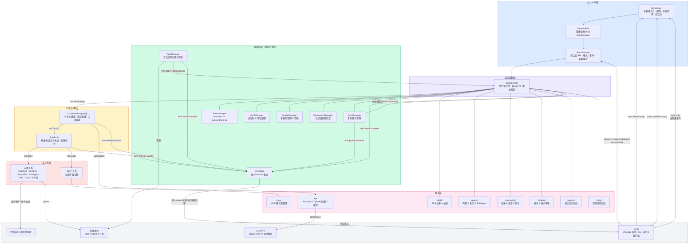

# 架构设计

## 设计原则

Sema Core 采用以下核心设计原则：

- **多会话隔离**：一个进程可同时持有多个 `SemaSession`，每个会话有独立状态、事件、输入队列和后台任务视图
- **事件驱动**：所有会话级状态变化通过带 `sessionId` 路由的事件总线传播，进程级资源变化通过 `SemaCore` 订阅
- **模块化分层**：公共 API、会话引擎、对话循环、管理器、工具和服务层职责分离
- **可插拔扩展**：模型、MCP、SubAgent、Command、Plugin 等支持 API 或配置文件管理；Skill、Memory、Rule 通过约定文件加载并可刷新
- **可中断**：耗时操作通过 `AbortController` 与多检查点配合，支持按会话中断

## 整体架构


```mermaid
graph TB
    subgraph PublicAPI["公共 API 层"]
        SC["SemaCore\n进程级入口 · 配置 · 全局资源 · 会话池"]
        SP["SessionPool\n创建/查找/关闭 SemaSession"]
        SS["SemaSession\n会话级 API · 输入 · 事件 · 权限响应"]
    end

    subgraph BusinessLogic["业务逻辑层"]
        SE["SemaEngine\n单会话引擎 · 输入队列 · 模式控制"]
    end

    subgraph ConversationLayer["对话处理层"]
        CQ["Conversation.query()\n异步生成器 · 流式处理 · 工具编排"]
        RT["RunTools\n并发/串行工具执行 · 权限检查"]
    end

    subgraph ManagerLayer["管理器层（单例注册表）"]
        SM["StateManager\nsessionId -> SessionRuntime"]
        CFM["ConfManager\n运行时 & 项目配置"]
        MM["ModelManager\n多模型管理 & 切换"]
        PM["PermissionManager\n会话级权限检查"]
        TM["TaskManager\n会话级后台任务调度"]
        CRM["CronManager\n定时任务管理"]
        EB["EventBus\n按 sessionId 路由"]
    end

    subgraph ToolSystem["工具系统"]
        BT["内置工具\nRunShell · ViewFile · PatchFile · SubAgent\nTodo · Cron · Skill 等"]
        MCP["MCP 工具\n动态扩展工具"]
    end

    subgraph Services["服务层"]
        LLM["api/\nAnthropic / OpenAI 适配 + 缓存"]
        SKL["skills/\nSkill 注册 & 加载"]
        AGT["agents/\n内置 & 自定义 SubAgent"]
        CMD["commands/\n系统 & 自定义命令"]
        PLG["plugins/\n插件 & 插件市场"]
        MEM["memory/\n记忆文件加载"]
        RUL["rules/\n项目规则加载"]
        MCPS["mcp/\nMCP 服务器管理"]
    end

    subgraph External["外部集成"]
        UI["UI 层\nVSCode 插件 / CLI / 自定义客户端"]
        LLMAPI["LLM API\nClaude / GPT / 其他模型"]
        FS["文件系统 / 项目代码库"]
        BG["后台进程\nShell / Agent 子任务"]
    end

    UI -->|"new SemaCore()"| SC
    UI -->|"core.createSession()"| SC
    SC --> SP
    SP --> SS
    SS --> SE
    UI -->|"session.processUserInput()\nsession.on()"| SS
    UI -->|"core.on()\n进程级事件"| SC

    SE -->|"processQuery()"| CQ
    CQ -->|"runTools()"| RT
    RT -->|"tool.call()"| BT
    RT -->|"tool.call()"| MCP
    CQ -->|"queryLLM()"| LLM
    LLM -->|"HTTP/SDK"| LLMAPI
    BT -->|"文件操作 / 命令执行"| FS
    BT -->|"spawn"| BG
    TM -->|"管理"| BG
    TM -->|"完成通知回调(sessionId)"| SE
    CRM -->|"触发通知(sessionId/active)"| SE

    SE --- SM
    SE --- CFM
    SE --- MM
    SE --- PM
    SE --- CRM
    SE --- SKL
    SE --- AGT
    SE --- CMD
    SE --- PLG
    SE --- MEM
    SE --- RUL
    MCP --- MCPS

    CQ -->|"emit session events"| EB
    RT -->|"emit session events"| EB
    SE -->|"emit session events"| EB
    TM -->|"emit session events"| EB
    CRM -->|"emit process events"| EB
    EB -->|"按 sessionId/全局监听器投递"| UI

    style PublicAPI fill:#dbeafe,stroke:#3b82f6
    style BusinessLogic fill:#ede9fe,stroke:#7c3aed
    style ConversationLayer fill:#fef3c7,stroke:#d97706
    style ManagerLayer fill:#d1fae5,stroke:#059669
    style ToolSystem fill:#fee2e2,stroke:#dc2626
    style Services fill:#fce7f3,stroke:#db2777
    style External fill:#f3f4f6,stroke:#6b7280
```

## 数据流

用户输入到响应输出的完整数据流：

```
用户输入
   │
   ▼
SemaSession.processUserInput(input)
   │
   ▼
SemaEngine.processUserInput()
   ├─ /quickchat 旁路：异步处理后直接返回
   ├─ 若本会话 state=processing → 入队（command / inject）
   └─ 否则 → startQuery() → processQuery()
          ├─ 解析系统/自定义命令、后台话题检测、解析 @文件引用
          ├─ 读取会话级系统提示快照
          └─ 触发 Conversation 会话循环
                 │
                 ▼
              调用 LLM API（流式）
                 ├─ emit message:thinking:chunk（sessionId 路由）
                 ├─ emit message:text:chunk（sessionId 路由）
                 ├─ emit message:complete（每次 LLM 响应完成）
                 └─ 收集 tool_use 块
                        │
                        ▼
                  执行工具（RunTools）
                  ├─ 只读工具 → 并发执行
                  └─ 写入工具 → 串行执行
                        │
                        ├─ emit tool:permission:request（当前会话）
                        ├─ emit tool:execution:chunk
                        ├─ emit tool:execution:complete
                        └─ 工具结果 → 返回 LLM
                               │
                               ▼
                          继续会话循环...
                               │
                               ▼（无工具调用时结束）
                          emit state:update { state: 'idle' }
   │
   ▼
processQuery.finally()
   ├─ 消费当前会话输入队列中的下一批（takeNextBatch）
   └─ 无剩余输入则设为 idle
```

## 核心模块说明

### SemaCore — 进程级入口

对外暴露的进程级门面：

- 管理 `SessionPool`，提供 `createSession` / `getSession` / `listSessions` / `closeSession`
- 管理模型、配置、MCP、Skill、Agent、Command、Memory、Rule、插件市场等全局资源
- 订阅进程级事件：`cron:update`、`mcp:server:status`
- `dispose()` 关闭所有会话并释放全局单例资源

### SemaSession — 会话级入口

单个会话的外部 API：

- 处理用户输入与中断
- 订阅会话级事件
- 响应工具权限、提问表单和 Plan 退出
- 切换当前会话的 Agent/Plan/Design 模式
- 管理当前会话的后台任务

### SemaEngine — 单会话引擎

核心业务逻辑的调度中心：

- 绑定固定 `sessionId`
- 使用 `SessionRuntime` 保存该会话状态
- 维护该会话的 `PendingUserInput` 队列
- `/quickchat` 旁路问答不影响主流程状态
- 注入 Task/Cron 通知回调，将通知作为 `silent` 输入注入目标会话
- 使用会话创建时冻结的系统提示快照
- 根据会话级 `agentMode` 注入模式提醒

### Conversation — 对话系统

基于异步生成器的 AI 对话循环：

- 流式接收 LLM 响应
- 每次 LLM 响应完成后发送 `message:complete`；若包含工具调用，再进入工具执行流程
- 智能选择工具执行策略（并发 / 串行）
- 多检查点的中断机制（基于 `AbortController.signal`）
- 自动压缩超长上下文（compact）
- 处理上下文重建信号（Plan 模式退出）

### Manager Layer — 管理器层

| 管理器 | 职责 | 持久化路径 |
|--------|------|-----------|
| StateManager | `sessionId -> SessionRuntime` 注册表；每个 Runtime 再按 `agentId` 隔离消息、Todos 和状态 | `~/.sema/history/<project>/` |
| ConfManager | 核心配置、按工作目录隔离的项目配置 | `~/.sema/projects.conf` |
| ModelManager | 模型配置与 main/quick 指针 | `~/.sema/model.conf` |
| PermissionManager | 工具执行权限检查；文件编辑 allow 权限按会话生效 | 项目配置中的 `allowedTools` |
| TaskManager | RunShell/SubAgent 后台任务；按会话过滤、限流、通知 | 临时目录 `os.tmpdir()/sema-tasks/` |
| CronManager | 定时任务创建、执行、持久化；触发时优先投递来源会话，兜底投递活跃会话 | 项目级 `.sema/scheduled_tasks.json` |

### Event System — 事件系统

- `EventBus` 是进程内单例传输层
- `SessionEventBus` 包装 `EventBus`，emit/on/once 自动带上 `sessionId`
- `SessionEventBus` 注册的会话级监听器只接收同会话事件
- `SemaCore.on` 仅暴露进程级事件（`cron:update` / `mcp:server:status`）；底层 `EventBus` 的全局监听器可接收同名事件的所有会话投递
- 事件日志在有 `sessionId` 时按 `YYYY-MM-DD_[sessionId].log` 分文件记录

## 扩展机制

| 扩展类型 | 扩展方式 | 存放位置 |
|---------|---------|---------|
| MCP 工具 | `addMCPServer()` API 或编辑 MCP 配置 | 用户级 `~/.sema/.mcp.json` / 项目级 `.sema/.mcp.json` |
| Skill | 创建 SKILL.md | 用户级 `~/.sema/skills/` / 项目级 `.sema/skills/` |
| SubAgent | 创建 Agent 配置 `.md` | 用户级 `~/.sema/agents/` / 项目级 `.sema/agents/` |
| 自定义命令 | 创建命令 `.md` | 用户级 `~/.sema/commands/` / 项目级 `.sema/commands/` |
| 自定义模型 | `addModel()` API | `~/.sema/model.conf` |
| 插件市场 | `addMarketplaceFromGit()` / `addMarketplaceFromDirectory()` API | 由 PluginsManager 管理 |
| Memory | 创建 `MEMORY.md` | 项目级 `.sema/memory/MEMORY.md` |
| Rule | 创建规则文件 `AGENTS.md` | 用户级 `~/.sema/AGENTS.md` / 项目根 `AGENTS.md` |

## 关键运行时特性

- **多会话并存**：`SessionPool` 持有多个 `SemaSession`，不会因新建会话自动中断或销毁旧会话
- **事件隔离**：消息流、状态、权限请求、工具执行和后台任务事件按 `sessionId` 投递
- **会话级权限**：文件编辑 allow 权限保存在 `SessionRuntime`，只影响当前会话
- **会话级系统提示快照**：创建会话时冻结提示词，后续轮次复用
- **输入队列**：`command` 类输入单独成批，`inject` 类输入合并成批，由 `takeNextBatch` 控制
- **后台任务隔离**：运行中任务上限和已结束任务归档按会话独立计算
- **旁路问答**：`/quickchat` 命令异步处理，不影响主流程状态和队列
- **自动压缩**：当上下文超长时自动触发 `compact` 压缩，子代理不执行压缩
