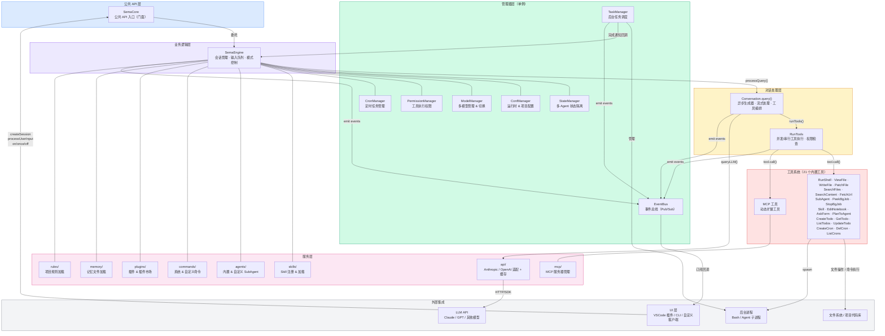

# 架构设计

## 设计原则

Sema Core 采用以下核心设计原则：

- **事件驱动**：所有状态变化通过事件总线传播，消费方只需订阅感兴趣的事件
- **模块化分层**：清晰的层次划分，各层职责单一、边界明确
- **可插拔扩展**：工具、模型、Skill、SubAgent、MCP、Plugin、Memory、Rule 均支持动态注册与替换
- **状态隔离**：主 Agent 与 SubAgent 各自维护独立的消息历史和运行状态
- **可中断**：所有耗时操作通过 `AbortController` 与多检查点配合，支持随时中断


## 整体架构


```mermaid
graph TB
    subgraph PublicAPI["公共 API 层"]
        SC["SemaCore\n公共 API 入口（门面）"]
    end

    subgraph BusinessLogic["业务逻辑层"]
        SE["SemaEngine\n会话管理 · 输入队列 · 模式控制"]
    end

    subgraph ConversationLayer["对话处理层"]
        CQ["Conversation.query()\n异步生成器 · 流式处理 · 工具编排"]
        RT["RunTools\n并发/串行工具执行 · 权限检查"]
    end

    subgraph ManagerLayer["管理器层（单例）"]
        SM["StateManager\n多 Agent 状态隔离"]
        CFM["ConfManager\n运行时 & 项目配置"]
        MM["ModelManager\n多模型管理 & 切换"]
        PM["PermissionManager\n工具执行权限"]
        TM["TaskManager\n后台任务调度"]
        CRM["CronManager\n定时任务管理"]
        EB["EventBus\n事件总线（Pub/Sub）"]
    end

    subgraph ToolSystem["工具系统（21 个内置工具）"]
        BT["RunShell · ViewFile · WriteFile · PatchFile\nSearchFiles · SearchContent · FetchUrl\nSubAgent · PeekBgJob · StopBgJob\nSkill · EditNotebook · AskForm · PlanToAgent\nCreateTodo · GetTodo · ListTodos · UpdateTodo\nCreateCron · DelCron · ListCrons"]
        MCP["MCP 工具\n动态扩展工具"]
    end

    subgraph Services["服务层"]
        LLM["api/\nAnthropic / OpenAI 适配 + 缓存"]
        SKL["skills/\nSkill 注册 & 加载"]
        AGT["agents/\n内置 & 自定义 SubAgent"]
        CMD["commands/\n系统 & 自定义命令"]
        PLG["plugins/\n插件 & 插件市场"]
        MEM["memory/\n记忆文件加载"]
        RUL["rules/\n项目规则加载"]
        MCPS["mcp/\nMCP 服务器管理"]
    end

    subgraph External["外部集成"]
        UI["UI 层\nVSCode 插件 / CLI / 自定义客户端"]
        LLMAPI["LLM API\nClaude / GPT / 其他模型"]
        FS["文件系统 / 项目代码库"]
        BG["后台进程\nBash / Agent 子进程"]
    end

    UI -->|"createSession\nprocessUserInput\non/once/off"| SC
    SC -->|委托| SE
    SE -->|"processQuery()"| CQ
    CQ -->|"runTools()"| RT
    RT -->|"tool.call()"| BT
    RT -->|"tool.call()"| MCP
    CQ -->|"queryLLM()"| LLM
    LLM -->|"HTTP/SDK"| LLMAPI
    BT -->|"文件操作 / 命令执行"| FS
    BT -->|"spawn"| BG
    TM -->|"管理"| BG
    TM -->|"完成通知回调"| SE

    SE --- SM
    SE --- CFM
    SE --- MM
    SE --- PM
    SE --- CRM
    SE --- SKL
    SE --- AGT
    SE --- CMD
    SE --- PLG
    SE --- MEM
    SE --- RUL
    MCP --- MCPS

    CQ -->|"emit events"| EB
    RT -->|"emit events"| EB
    SE -->|"emit events"| EB
    TM -->|"emit events"| EB
    EB -->|"订阅回调"| UI

    style PublicAPI fill:#dbeafe,stroke:#3b82f6
    style BusinessLogic fill:#ede9fe,stroke:#7c3aed
    style ConversationLayer fill:#fef3c7,stroke:#d97706
    style ManagerLayer fill:#d1fae5,stroke:#059669
    style ToolSystem fill:#fee2e2,stroke:#dc2626
    style Services fill:#fce7f3,stroke:#db2777
    style External fill:#f3f4f6,stroke:#6b7280
```


## 数据流

用户输入到响应输出的完整数据流：

```
用户输入
   │
   ▼
SemaCore.processUserInput(input)
   │
   ▼
SemaEngine.processUserInput()
   ├─ /quickchat 旁路：异步处理后直接返回
   ├─ 若状态为 processing → 入队（command / inject 类型）
   └─ 否则 → startQuery() → processQuery()
          ├─ 解析系统/自定义命令、后台话题检测、解析 @文件引用
          ├─ 构建提示词
          └─ 触发 Conversation会话循环
                 │
                 ▼
              调用 LLM API（流式）
                 ├─ emit message:thinking:chunk
                 ├─ emit message:text:chunk
                 └─ 收集 tool_use 块
                        │
                        ▼
                  执行工具（RunTools）
                  ├─ 只读工具 → 并发执行
                  └─ 写入工具 → 串行执行
                        │
                        ├─ emit tool:permission:request（需授权时）
                        ├─ emit tool:execution:chunk（流式中间态）
                        ├─ emit tool:execution:complete
                        └─ 工具结果 → 返回 LLM
                               │
                               ▼
                          继续会话循环...
                               │
                               ▼（无工具调用时结束）
                          emit message:complete
                          emit state:update { state: 'idle' }
   │
   ▼
processQuery.finally()
   ├─ 优先处理 pendingSession（会话切换）
   └─ 否则消费输入队列中的下一批（takeNextBatch）
```

## 核心模块说明

### SemaCore — 公共 API 层

对外暴露的唯一入口，采用外观（Facade）模式：
- 封装内部复杂度，提供简洁的 API
- 代理事件系统（on / once / off）
- 处理用户响应（工具权限、提问、Plan 退出）
- 提供模型、配置、MCP、Skill、Agent、Command、Memory、Rule、插件市场、后台任务等管理 API
- `dispose()` 统一清理所有单例资源

### SemaEngine — 引擎层

核心业务逻辑的调度中心：
- 维护 `pendingSession` 与 `currentProcessingPromise`，实现会话切换的等待与覆盖
- 维护 `PendingUserInput` 队列：处理中收到的输入按 `command`/`inject` 类型入队，处理完成后由 finally 自动消费
- `/quickchat` 旁路问答：不影响主流程状态
- 注入 `TaskManager` 后台通知回调，将后台任务完成通知作为 `silent` 输入注入主对话
- 注入 `CronManager` 定时任务通知回调
- 根据 `agentMode`（Agent / Plan）动态组装工具集
- 处理文件引用、系统提示词构建

### Conversation — 对话系统

基于异步生成器的 AI 对话循环：
- 流式接收 LLM 响应
- 智能选择工具执行策略（并发 / 串行）
- 多检查点的中断机制（基于 `AbortController.signal`）
- 自动压缩超长上下文（compact）
- 处理上下文重建信号（Plan 模式退出）

### Manager Layer — 管理器层

六个单例管理器，负责不同维度的状态：

| 管理器 | 职责 | 持久化路径 |
|--------|------|-----------|
| StateManager | 会话状态、消息历史、Todos、输入队列 | `~/.sema/history/<project>/` |
| ConfManager | 核心配置、项目配置 | `~/.sema/projects.conf` |
| ModelManager | 模型配置与切换 | `~/.sema/model.conf` |
| PermissionManager | 工具执行权限检查 | 项目配置中的 `allowedTools` |
| TaskManager | 后台任务调度（RunShell/SubAgent） | 临时目录（`os.tmpdir()/sema-tasks/`） |
| CronManager | 定时任务管理（Cron 调度） | 项目级 `.sema/scheduled_tasks.json` |

### Event System — 事件系统

基于发布-订阅模式的单例事件总线：
- 解耦各模块间的依赖
- 支持流式 UI 更新
- 所有外部状态变化均通过事件通知
- 涵盖会话生命周期、AI 消息、工具执行、子代理、后台任务、Plan 模式、提问交互、上下文统计、旁路问答、定时任务、MCP 状态等

## 扩展机制

| 扩展类型 | 扩展方式 | 存放位置 |
|---------|---------|---------|
| MCP 工具 | `addMCPServer()` API 或编辑 MCP 配置 | 用户级 `~/.sema/.mcp.json` / 项目级 `.sema/.mcp.json` |
| Skill | 创建 SKILL.md | 用户级 `~/.sema/skills/` / 项目级 `.sema/skills/` |
| SubAgent | 创建 Agent 配置 `.md` | 用户级 `~/.sema/agents/` / 项目级 `.sema/agents/` |
| 自定义命令 | 创建命令 `.md` | 用户级 `~/.sema/commands/` / 项目级 `.sema/commands/` |
| 自定义模型 | `addModel()` API | `~/.sema/model.conf` |
| 插件市场 | `addMarketplaceFromGit()` / `addMarketplaceFromDirectory()` API | 由 PluginsManager 管理 |
| Memory | Memory.md 等记忆文件 | 由 MemoryManager 自动加载 |
| Rule | 项目规则文件 | 由 RuleManager 自动加载 |

## 关键运行时特性

- **可中断**：`AbortController` 在 `processQuery` 多个检查点验证（AI 响应后、工具执行前/中/后），确保会话切换或用户中断后立即返回
- **会话切换**：新 `createSession` 在处理中时会等待旧会话结束（最多 10 秒），由 `pendingSession` + finally 链路完成切换
- **输入队列**：`command` 类输入立即单独成批，`inject` 类输入合并成批，由 `takeNextBatch` 控制
- **旁路问答**：`/quickchat` 命令异步处理，不影响主流程状态和队列
- **后台任务**：`run_shell` 与 `sub_agent` 通过 `run_in_background` 进入后台，由 `TaskManager` 管理；可通过 `disableBackgroundTasks` 配置在 schema 层面禁用
- **前后台转换**：`transferAgentToBackground` 支持将运行中的前台 Agent 转为后台执行
- **自动压缩**：当上下文超长时自动触发 `compact` 压缩，子代理不执行压缩
